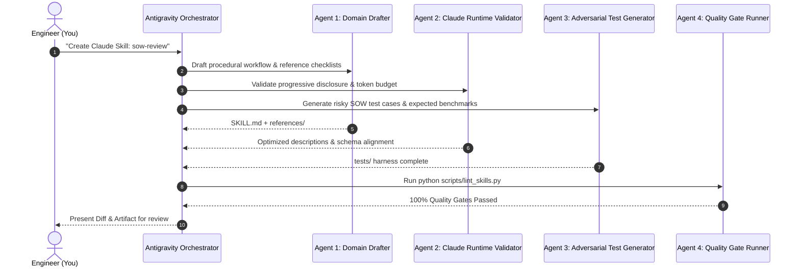

# Antigravity as the Skill Factory: Multi-Agent Workflow

This document outlines the multi-agent development pattern used inside **Google Antigravity** to scaffold, author, stress-test, and package skills.

---

## The 4-Agent Parallel Pipeline

When authoring complex skills, Antigravity decomposes the work into specialized sub-roles:

---

## Agent Responsibilities

### 1. Domain Drafter Agent
- Researches the specific domain topic (e.g. Meridian MMM, SOW commercial law, Azure ML infrastructure).
- Establishes the procedural decision tree for `SKILL.md`.
- Separates domain reference checklists into `references/`.

### 2. Claude Runtime Validator Agent
- Checks the frontmatter description to prevent false positives and maximize trigger precision.
- Validates that output schemas are deterministic (tables, enums, sections).
- Verifies that cross-file markdown links use standard relative paths.

### 3. Adversarial Test Generator Agent
- Generates realistic test cases (`tests/input-risky-*.md`).
- Authors gold-standard expected evaluation rubrics (`tests/expected-eval.md`).
- Ensures tests challenge Claude with subtle omissions and dangerous edge cases.

### 4. Quality Gate Runner Agent
- Executes `python scripts/lint_skills.py`.
- Enforces zero broken links, schema compliance, and clean Git commits.
